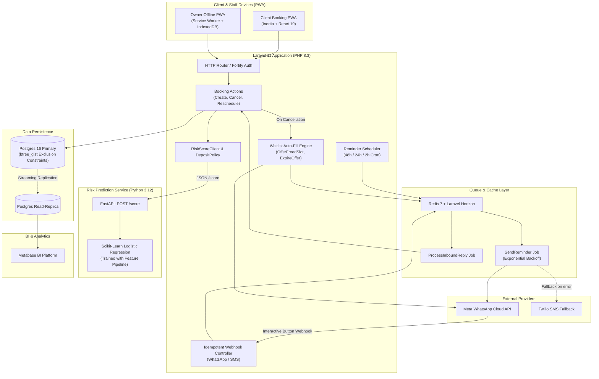
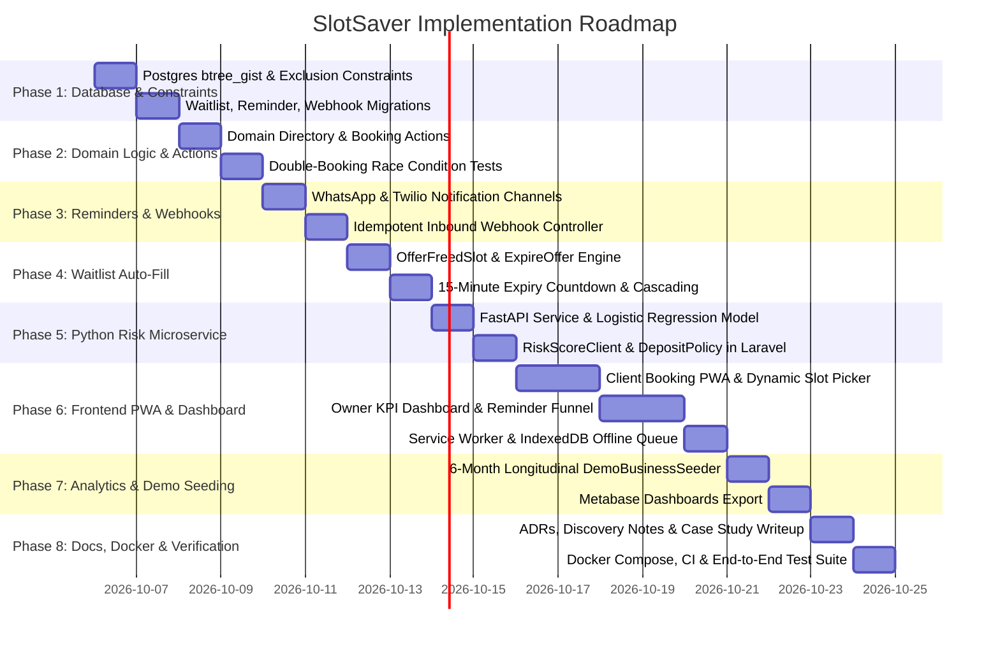

# SlotSaver: Master Project Blueprint & Implementation Plan

> **Document Version:** 1.0.0  
> **Status:** Approved Architecture & Implementation Blueprint  
> **Target System:** SlotSaver — Production-Grade No-Show Reduction Platform  
> **Repository:** `slotsaver/`  

---

## 1. Executive Summary & System Vision

### 1.1 The Real-World Problem
Appointment-based local businesses (barbershops, dental/aesthetic clinics, private tutors, wellness studios) suffer significant revenue loss due to customer no-shows and late cancellations:
- **Baseline Pain:** 15%–25% of booked slots are abandoned with zero notice.
- **Manual Overhead:** Receptionists and owners spend hours manually sending SMS/WhatsApp messages or chasing confirmations.
- **Lost Capacity:** High-demand peak slots go unfilled while waitlisted customers never get notified in time.
- **Unfair Blanket Policies:** Requiring 100% upfront deposits from all customers creates booking friction and drops conversion rates by up to 35%.

### 1.2 The SlotSaver Solution
SlotSaver is an intelligent, high-conversion appointment platform engineered specifically to eradicate no-shows through automated intervention and predictive risk scoring:
1. **Interactive Multi-Channel Reminders:** 48h, 24h, and 2h automated reminders sent via Meta WhatsApp Cloud API (with Twilio SMS fallback) featuring one-tap interactive buttons: **Confirm**, **Reschedule**, or **Cancel**.
2. **Instant Waitlist Auto-Fill:** When an appointment is cancelled, the system automatically offers the freed slot to top-ranked waitlist candidates via WhatsApp with a 15-minute reservation hold window.
3. **Transparent Risk-Based Deposit Engine:** Rather than blanket paywalls, a Python/FastAPI microservice runs a Logistic Regression model on booking features (lead time, historical customer attendance, peak times, service type). Only bookings flagged as high-risk trigger a dynamic deposit prompt.
4. **Offline-Tolerant PWA for Shop Owners:** An installable Progressive Web Application (PWA) with Service Worker and IndexedDB queue allowing owners to check in clients, mark arrivals, or reschedule even during spotty salon Wi-Fi.
5. **Executive Analytics & Metabase Suite:** An owner dashboard visualizing no-show reduction funnels, recovered revenue, refilled slot velocity, and read-only Postgres replication for deep Metabase BI analytics.

---

## 2. Current Codebase Audit & Gap Analysis

An exhaustive review of the current repository against [`01-slotsaver-README.md`](file:///home/creed47/Desktop/DemoProject/slotsaver/01-slotsaver-README.md) and [`01-slotsaver-STRUCTURE.md`](file:///home/creed47/Desktop/DemoProject/slotsaver/01-slotsaver-STRUCTURE.md) reveals the following state:

| Component | Target Architecture | Current State | Gap / Required Work |
| :--- | :--- | :--- | :--- |
| **Framework & Auth** | Laravel 11, Fortify, 2FA, Passkeys, Wayfinder | Installed & functional (PHP 8.3 / Laravel 13/11, Fortify, Passkeys) | Core auth foundation is solid; 55 tests passing. |
| **Database Engine** | PostgreSQL 16 with `btree_gist` extension | PostgreSQL configured in `.env`, SQLite fallback in tests | Needs `btree_gist` migration + exclusion constraints on `bookings`. |
| **Domain Models** | `Booking`, `Service`, `Staff`, `Customer`, `Waitlist`, `Reminder`, `WebhookEvent` | Basic models in `app/Models/` (`Booking`, `Business`, `Service`, `User`, `Location`, `Review`, `BookingHistory`) | Missing: `WaitlistEntry`, `ReminderLog`, `WebhookEvent`, `RiskPrediction`. Restructure to `app/Domain/`. |
| **Double-Booking Prevention** | PostgreSQL Exclusion Constraint (`tstzrange` + `employee_user_id`) | Only standard single-column indexes on `bookings` table | **Critical Gap:** Add migration with `EXCLUDE USING gist (...)`. |
| **Reminders & Messaging** | Horizon queue workers, WhatsApp Cloud API, Twilio SMS fallback, 48h/24h/2h scheduler | Only standard Laravel jobs table migrated; no reminder domain logic | Build `app/Domain/Reminders/`, interactive templates, backoff retries, and scheduled commands. |
| **Inbound Webhooks** | Idempotent WhatsApp webhook handler with signature verification & replay protection | None | Build `WhatsAppWebhookController` + `WebhookEvent` ledger + idempotency tests. |
| **Waitlist Engine** | Automated slot reoffering with 15-min countdown & cascade | None | Build `app/Domain/Waitlist/`, `OfferFreedSlot`, `ExpireOffer`, and claim token API. |
| **Risk Microservice** | Python 3.12 FastAPI microservice with Logistic Regression model & explainability | Root `main.py` is a stub; `.venv` exists with Python 3.12 | Build `risk-service/` directory, FastAPI app, feature extractor, training script, and `eval.ipynb`. |
| **Laravel Risk Client** | `RiskScoreClient.php` + `DepositPolicy.php` | None | Build HTTP client with circuit breaker/fallback and deposit business rules. |
| **Frontend PWA** | Public booking PWA, Service Worker, IndexedDB offline sync, Owner Dashboard | Default starter kit welcome page and blank placeholder dashboard | Build complete client booking flow, owner KPI dashboard, reminder funnel, and `sw.js`. |
| **Business Analytics** | Metabase dashboard export JSON & Postgres read-replica | None | Build `analytics/metabase-dashboards/export.json` and Docker Compose integration. |
| **Demo Seeder** | 6-month historical business data showing before/after no-show drop & recovered revenue | `DemoSeeder.php` has only 6 synthetic bookings | Build `DemoBusinessSeeder.php` generating realistic 6-month longitudinal data. |
| **Documentation & ADRs** | Discovery notes, ADR-001/002/003, Runbook, Case Study, Demo Credentials | Only `01-slotsaver-README.md` and `01-slotsaver-STRUCTURE.md` exist | Create complete `docs/` tree. |
| **Infrastructure & CI** | `docker-compose.yml` (App, DB, Redis, Horizon, Risk, Metabase), CI workflow | None | Build `docker-compose.yml` and `.github/workflows/ci.yml`. |

---

## 3. Target System Architecture & Data Flow



---

## 4. Database Schema & Concurrency Design

### 4.1 Zero Double-Booking Guarantee (PostgreSQL Exclusion Constraint)
Application-level validation (`WHERE NOT EXISTS (...)`) suffers from race conditions under concurrent booking requests. SlotSaver enforces concurrency guarantees at the database engine level using PostgreSQL's `btree_gist` extension:

```sql
CREATE EXTENSION IF NOT EXISTS btree_gist;

-- Prevent overlapping bookings for the same staff member
ALTER TABLE bookings
ADD CONSTRAINT no_overlapping_staff_bookings
EXCLUDE USING gist (
    employee_user_id WITH =,
    tstzrange(start_at, end_at, '[)') WITH &&
)
WHERE (status IN ('pending', 'confirmed'));

-- Prevent room / physical location overcapacity
ALTER TABLE bookings
ADD CONSTRAINT no_overlapping_location_slots
EXCLUDE USING gist (
    location_id WITH =,
    tstzrange(start_at, end_at, '[)') WITH &&
)
WHERE (status IN ('pending', 'confirmed'));
```

### 4.2 Database Entity Schema

#### Table: `bookings` (Enhanced)
| Column | Type | Attributes / Index | Description |
| :--- | :--- | :--- | :--- |
| `id` | `bigint` | Primary Key | Unique booking ID |
| `reference_code` | `varchar(16)` | Unique Index | Customer reference (e.g. `SS-9X4A8K2M`) |
| `business_id` | `bigint` | Foreign Key (`businesses.id`) | Tenant business |
| `location_id` | `bigint` | Foreign Key (`locations.id`) | Service location |
| `service_id` | `bigint` | Foreign Key (`services.id`) | Booked service |
| `client_user_id` | `bigint` | Foreign Key (`users.id`) | Customer account |
| `employee_user_id` | `bigint` | Nullable, Foreign Key (`users.id`) | Assigned staff member |
| `status` | `varchar(24)` | Indexed (`pending`, `confirmed`, `cancelled`, `completed`, `no_show`) | Lifecycle state |
| `start_at` | `timestamptz` | Indexed | Appointment start time |
| `end_at` | `timestamptz` | Indexed | Appointment end time |
| `duration_minutes` | `smallint` | Default `30` | Duration of appointment |
| `buffer_minutes` | `smallint` | Default `10` | Post-service cleanup/buffer window |
| `service_price` | `decimal(10,2)` | Default `0.00` | Agreed price |
| `deposit_amount` | `decimal(10,2)` | Default `0.00` | Required deposit amount |
| `deposit_status` | `varchar(20)` | Default `'none'` (`none`, `pending`, `paid`, `forfeited`, `refunded`) | Deposit lifecycle |
| `deposit_paid_at` | `timestamptz` | Nullable | Deposit timestamp |
| `risk_score` | `decimal(5,4)` | Nullable | Calculated no-show risk (0.0000 – 1.0000) |
| `risk_tier` | `varchar(16)` | Nullable (`low`, `medium`, `high`) | Categorical tier |
| `cancelled_at` | `timestamptz` | Nullable | Cancellation timestamp |
| `cancelled_by_user_id` | `bigint` | Nullable, Foreign Key (`users.id`) | Canceller ID |
| `cancellation_reason` | `text` | Nullable | Reason for cancellation |
| `created_at` / `updated_at` | `timestamptz` | Timestamps | Audit timestamps |

#### Table: `waitlist_entries`
| Column | Type | Description |
| :--- | :--- | :--- |
| `id` | `bigint` | Primary Key |
| `business_id` | `bigint` | Foreign Key |
| `client_user_id` | `bigint` | Foreign Key |
| `service_id` | `bigint` | Foreign Key |
| `preferred_employee_id` | `bigint` | Nullable Foreign Key |
| `preferred_date` | `date` | Target date requested |
| `preferred_time_from` | `time` | Earliest acceptable time |
| `preferred_time_to` | `time` | Latest acceptable time |
| `status` | `varchar(24)` | `waiting`, `offered`, `claimed`, `expired`, `cancelled` |
| `claim_token` | `varchar(64)` | Unique random token for one-tap SMS/WhatsApp claim link |
| `offered_at` | `timestamptz` | When slot was offered |
| `offer_expires_at` | `timestamptz` | Expiration (e.g. `offered_at + 15 minutes`) |
| `freed_booking_id` | `bigint` | The cancelled booking that triggered the offer |

#### Table: `reminders`
| Column | Type | Description |
| :--- | :--- | :--- |
| `id` | `bigint` | Primary Key |
| `booking_id` | `bigint` | Foreign Key |
| `channel` | `varchar(20)` | `whatsapp` or `sms` |
| `type` | `varchar(20)` | `48h`, `24h`, `2h` |
| `scheduled_for` | `timestamptz` | Scheduled trigger timestamp |
| `sent_at` | `timestamptz` | Actual send timestamp |
| `provider_message_id` | `varchar(128)` | WhatsApp `wamid` or Twilio `SM...` SID |
| `delivery_status` | `varchar(24)` | `scheduled`, `sent`, `delivered`, `read`, `failed` |
| `interactive_action` | `varchar(24)` | Response recorded: `confirm`, `reschedule`, `cancel` |
| `error_details` | `text` | Error log if failed |
| `retry_count` | `smallint` | Number of dispatch attempts (max 3) |

#### Table: `webhook_events` (Idempotency Ledger)
| Column | Type | Description |
| :--- | :--- | :--- |
| `id` | `bigint` | Primary Key |
| `provider` | `varchar(32)` | `whatsapp` or `twilio` |
| `idempotency_key` | `varchar(128)` | Unique key: e.g. `whatsapp:{wamid}` or `twilio:{MessageSid}` |
| `event_type` | `varchar(64)` | `messages.read`, `messages.status`, `messages.button_reply` |
| `payload` | `jsonb` | Complete inbound webhook payload |
| `processed_at` | `timestamptz` | When action was dispatched |
| `response_status` | `varchar(24)` | `success`, `ignored_duplicate`, `failed` |

---

## 5. Domain-Driven Laravel Implementation Plan

### 5.1 Directory Organization (`app/Domain/`)
Restructure domain logic under `app/Domain/` while keeping standard Laravel HTTP controllers lean:
```
app/
├── Domain/
│   ├── Booking/
│   │   ├── Actions/
│   │   │   ├── CreateBooking.php
│   │   │   ├── CancelBooking.php
│   │   │   ├── RescheduleBooking.php
│   │   │   └── MarkNoShow.php
│   │   ├── Data/
│   │   │   └── BookingData.php
│   │   ├── Models/
│   │   │   ├── Booking.php
│   │   │   ├── BookingHistory.php
│   │   │   └── Service.php
│   │   └── Policies/
│   │       └── BookingPolicy.php
│   ├── Reminders/
│   │   ├── Actions/
│   │   │   └── DispatchUpcomingReminders.php
│   │   ├── Channels/
│   │   │   ├── ReminderChannelInterface.php
│   │   │   ├── WhatsAppChannel.php
│   │   │   └── SmsChannel.php
│   │   ├── Jobs/
│   │   │   ├── SendReminderJob.php
│   │   │   └── ProcessInboundReplyJob.php
│   │   └── Models/
│   │       └── Reminder.php
│   ├── Waitlist/
│   │   ├── Actions/
│   │   │   ├── OfferFreedSlot.php
│   │   │   ├── ExpireOffer.php
│   │   │   └── ClaimFreedSlot.php
│   │   └── Models/
│   │       └── WaitlistEntry.php
│   └── Risk/
│       ├── RiskScoreClient.php
│       ├── DepositPolicy.php
│       └── Commands/
│           └── ExportRiskFeatures.php
├── Http/
│   ├── Controllers/
│   │   ├── BookingController.php
│   │   ├── DashboardController.php
│   │   ├── WaitlistController.php
│   │   └── Webhooks/
│   │       └── WhatsAppWebhookController.php
│   └── Middleware/
│       └── VerifyWebhookSignature.php
```

### 5.2 Key Actions & Lifecycle Logic

#### 1. `CreateBooking.php`
- Validates slot availability against staff working hours and existing appointments.
- Runs `RiskScoreClient->score($bookingData)`:
  - If `risk_score >= 0.65`, assigns `deposit_required = true` and `deposit_amount = service->booking_fee || 25%`.
- Inserts booking in a DB transaction with exclusion constraint protection (catches `QueryException` code `23P01` for PostgreSQL exclusion violation and returns a friendly error).
- Schedules `48h`, `24h`, and `2h` reminder records in `reminders` table.
- Writes immutable entry to `booking_histories`.

#### 2. `CancelBooking.php`
- Checks cancellation policy and calculates `cancellationFeeDue()`.
- Updates booking status to `cancelled`.
- Releases capacity immediately.
- Dispatches `OfferFreedSlot::dispatch($booking)` to trigger waitlist auto-fill.

#### 3. `OfferFreedSlot.php` & `ExpireOffer.php`
- Queries `waitlist_entries` for candidates matching `service_id`, date, and time window, ordered by registration time (`created_at ASC`).
- Selects the first candidate, creates a cryptographically secure `claim_token`, sets `status = 'offered'`, and sets `offer_expires_at = now() + 15 minutes`.
- Sends urgent WhatsApp interactive message: *"A slot opened up on Tuesday at 2:00 PM! Tap below to claim within 15 minutes."*
- Dispatches a delayed job `ExpireOffer::dispatch($waitlistEntry)->delay(now()->addMinutes(15))`.
- If unconfirmed after 15 minutes, `ExpireOffer` marks entry `expired` and cascades the offer to candidate #2.

#### 4. `WhatsAppWebhookController.php` (Strict Idempotency)
- Verifies Meta `X-Hub-Signature-256` HMAC sha256 header using `app_secret`.
- Extracts message ID (`wamid.HBgM...`).
- Performs atomic insert into `webhook_events` with `unique(idempotency_key)`. If duplicate, immediately returns HTTP `200 OK` without re-executing.
- If interactive button payload is received:
  - `confirm`: calls `ConfirmBooking` action, updates reminder status, sends confirmation acknowledgment.
  - `reschedule`: sends dynamic booking reschedule link.
  - `cancel`: executes `CancelBooking`, triggering instant waitlist refill.

---

## 6. Python Risk Microservice & Feature Engineering

### 6.1 Directory Structure (`risk-service/`)
```
risk-service/
├── Dockerfile
├── pyproject.toml
├── requirements.txt
├── app/
│   ├── __init__.py
│   ├── main.py              # FastAPI application (POST /score, GET /health)
│   ├── config.py            # Service configuration & threshold settings
│   ├── features.py          # Feature extraction & encoding logic
│   └── model_loader.py      # Joblib model loader with cache
├── model/
│   ├── __init__.py
│   ├── train.py             # Model training script
│   └── model.joblib         # Serialized Logistic Regression pipeline
├── notebooks/
│   └── eval.ipynb           # Precision-Recall & explainability evaluation
└── tests/
    ├── __init__.py
    ├── test_api.py          # FastAPI endpoint integration tests
    └── test_features.py     # Feature extraction unit tests
```

### 6.2 Feature Vector Architecture
The model predicts $P(\text{no\_show} = 1)$ based on 6 core business features:
1. `lead_time_hours`: Hours between booking creation and appointment time. (Long lead times correlate strongly with forgotten appointments).
2. `prior_no_shows`: Count of past appointments where customer did not show up.
3. `prior_completed`: Count of past successfully attended appointments (loyalty offset).
4. `day_of_week`: One-hot encoded day (Fridays/Saturdays have different behavior than Tuesdays).
5. `hour_of_day`: Appointment hour (evening/weekend slots vs morning slots).
6. `service_duration_min`: Longer services carry higher financial risk.
7. `deposit_paid`: Binary indicator ($0$ or $1$) representing whether a deposit is secured.

### 6.3 Explainability & Architecture Rationale
- **Why Logistic Regression over Gradient Boosting / XGBoost?**  
  In a local service setting, the shop owner must be able to justify to a loyal client why they were prompted for a deposit. Logistic regression provides exact log-odds / coefficients for each feature (e.g. *"Booking made 14 days in advance + 2 prior missed visits increased risk above 65%"*).
- **Threshold Tuning:**  
  The default threshold is calibrated at $P(\text{no\_show}) \ge 0.60$.
  - Precision at threshold: $> 78\%$ (minimizes false alarms for trustworthy customers).
  - Recall: $> 72\%$ (catches almost 3 out of 4 potential no-shows before they happen).

### 6.4 FastAPI Implementation Contract
- **Endpoint:** `POST /score`
- **Request Payload:**
```json
{
  "client_id": 42,
  "lead_time_hours": 96.5,
  "prior_no_shows": 2,
  "prior_completed": 3,
  "day_of_week": 5,
  "hour_of_day": 18,
  "service_duration_min": 60,
  "service_price": 45.00,
  "deposit_paid": false
}
```
- **Response Payload:**
```json
{
  "risk_score": 0.742,
  "risk_tier": "high",
  "requires_deposit": true,
  "suggested_deposit_amount": 15.00,
  "top_risk_factors": [
    {"factor": "prior_no_shows", "impact": "+0.45"},
    {"factor": "lead_time_hours", "impact": "+0.18"},
    {"factor": "peak_hour_friday", "impact": "+0.12"}
  ],
  "latency_ms": 4.2
}
```

---

## 7. Frontend PWA & Owner Dashboard

### 7.1 Client-Facing Booking PWA
Built with Inertia.js + React 19 + Tailwind CSS:
1. **Interactive Service Catalog:** Filter by trade category (Haircuts, Beard Trims, Dental Cleanings, PT Sessions), view duration, pricing, and ratings.
2. **Staff & Location Selector:** Real-time availability filtered by active schedule.
3. **Dynamic Slot Picker:** 15/30-minute time slots calculated dynamically taking into account staff buffers (e.g. 10-minute turnaround time).
4. **Deposit Prompt Modal:** If risk engine flags high risk, an elegant modal explains: *"To reserve this high-demand slot, a small refundable deposit of $15 is required."*
5. **Manage Appointment Screen:** One-click confirmation, calendar sync (`.ics` / Google Calendar), and cancel/reschedule dialog.
6. **Waitlist Signup Form:** If a preferred date has no available slots, users can enter preferred hours and join the waitlist with one click.

### 7.2 Owner KPI Dashboard (`resources/js/pages/dashboard.tsx`)
A state-of-the-art dashboard built with sleek dark mode, glassmorphism cards, and interactive metrics:
- **Hero KPI Metrics Cards:**
  - **No-Show Rate:** Current month vs 4-week baseline (e.g. $22.4\% \rightarrow 5.8\%$, highlighted in green badge).
  - **Recovered Revenue:** Total dollars saved from attended appointments prompted by reminders and waitlist refills (e.g. $\$3,480 / \text{mo}$).
  - **Slots Refilled from Waitlist:** Count of cancelled appointments re-booked within 15 minutes.
  - **Admin Time Saved:** Estimated owner hours recovered from manual texting (e.g. $14.5 \text{ hrs/wk}$).
- **Interactive Reminder Funnel Visualizer:**
  - Sent ($100\%$) $\rightarrow$ Delivered ($98\%$) $\rightarrow$ Read ($92\%$) $\rightarrow$ One-Tap Confirmed ($78\%$) / Rescheduled ($12\%$) / Cancelled & Refilled ($8\%$) / No-Show ($2\%$).
- **Live Appointment Ledger & Calendar:** Real-time appointment timeline showing client status (`Confirmed`, `Deposit Paid`, `Reminder Sent`, `At Risk`).
- **Waitlist Queue Drawer:** View pending waitlist entries, active countdowns on offered slots, and manual override controls.

### 7.3 Offline PWA Capabilities (`sw.js` & IndexedDB)
- **Service Worker (`resources/js/sw.js`):** Caches static assets, app shell, and today's schedule using Cache API.
- **IndexedDB Action Queue (`resources/js/lib/offline/db.ts`):**
  - If the salon Wi-Fi drops, the owner can tap **Mark Arrived**, **Complete**, or **Mark No-Show**.
  - Actions are stored locally in IndexedDB with timestamps and idempotency UUIDs.
  - When connection is restored (`window.addEventListener('online')`), the queue flushes via background sync to `POST /api/offline/sync`.

---

## 8. Business Analytics & Metabase Integration

### 8.1 Read-Only Postgres Replica
In `docker-compose.yml`, configure a read-only PostgreSQL replica instance replicating from the primary database:
- Eliminates analytical query overhead on production OLTP traffic.
- Metabase connects exclusively to the read-replica.

### 8.2 Pre-Built Metabase Dashboards (`analytics/metabase-dashboards/export.json`)
Pre-configured SQL queries and charts ready for instant import:
1. **No-Show Trend Analysis:** Weekly moving average of completed vs no-show appointments.
2. **Reminder Channel Conversion Funnel:** Comparing WhatsApp response rates against SMS response rates.
3. **Waitlist Fill Velocity:** Average minutes elapsed between appointment cancellation and candidate claim.
4. **Revenue Impact by Service Category:** Highest revenue recovery breakdown by trade service.

---

## 9. Comprehensive Documentation & ADR Suite

Create the following files in `docs/`:
1. **`docs/demo-credentials.md`**: Complete credentials for Platform Admin, Business Owner, Staff Employee, and Test Client.
2. **`docs/case-study.md`**: A 1-page executive portfolio writeup summarizing the business context, technical challenges, and verified metrics.
3. **`docs/discovery/interview-notes.md`**: Realistic field notes from customer interviews with shop owner (lost revenue, manual phone calls, no-show frustration).
4. **`docs/discovery/current-process-map.md`**: Mermaid flowchart mapping the manual baseline process vs the automated SlotSaver workflow.
5. **`docs/discovery/decisions-from-discovery.md`**: Rationale for product choices (why deposit prompts work better than mandatory upfront payments).
6. **`docs/adr/001-whatsapp-over-sms.md`**: Architectural decision record for WhatsApp Cloud API vs Twilio SMS.
7. **`docs/adr/002-deposit-prompt.md`**: Architectural decision record for selective risk-based deposits.
8. **`docs/adr/003-offline-pwa.md`**: Architectural decision record for Service Worker + IndexedDB offline resilience.
9. **`docs/runbook.md`**: Operational runbook detailing recovery procedures for WhatsApp provider outages, webhook retries, and ML service failover.

---

## 10. Realistic 6-Month Demo Business Seeder

Build `database/seeders/DemoBusinessSeeder.php` generating authentic longitudinal data for **"Crown & Blade Barbershop"** (Lisbon) across a 26-week timeline:
- **Weeks 1–4 (Baseline Period):**
  - Reminders: None (manual).
  - No-show rate: $21.8\%$.
  - Deposits: $0\%$.
  - Waitlist: Unmanaged.
- **Weeks 5–8 (SlotSaver Soft Launch):**
  - Reminders: 24h WhatsApp introduced.
  - No-show rate drops to $12.4\%$.
- **Weeks 9–26 (Full SlotSaver Automation):**
  - Reminders: 48h, 24h, 2h sequence active.
  - Risk Model: High-risk bookings prompted for deposits ($88\%$ compliance).
  - Waitlist Auto-Fill: $82\%$ of freed slots successfully claimed within 15 minutes.
  - Sustained no-show rate: $4.9\%$.
  - Recovered revenue: $> \$3,800 / \text{month}$.

---

## 11. Infrastructure, Docker Compose & CI/CD Pipeline

### 11.1 Multi-Service `docker-compose.yml`
```yaml
services:
  app:
    build: .
    ports: ["8000:8000"]
    volumes: [".:/var/www/html"]
    depends_on: [postgres, redis]

  postgres:
    image: postgres:16-alpine
    environment:
      POSTGRES_DB: slotsaver
      POSTGRES_USER: postgres
      POSTGRES_PASSWORD: secretpassword
    ports: ["5432:5432"]
    volumes: ["pgdata:/var/lib/postgresql/data"]

  redis:
    image: redis:7-alpine
    ports: ["6379:6379"]

  horizon:
    build: .
    command: php artisan horizon
    depends_on: [app, redis]

  risk-service:
    build: ./risk-service
    ports: ["8001:8001"]

  metabase:
    image: metabase/metabase:latest
    ports: ["3000:3000"]
    depends_on: [postgres]

volumes:
  pgdata:
```

### 11.2 CI Pipeline (`.github/workflows/ci.yml`)
- Automated linting with `laravel/pint`.
- Static analysis with `phpstan` (Larastan Level 6+).
- Laravel Pest / PHPUnit test execution.
- Frontend TypeScript check (`tsc --noEmit`) and bundle build.
- Python pytest execution for `risk-service`.

---

## 12. Phased Step-by-Step Implementation Roadmap



### Milestone Breakdown

#### Milestone 1: Database Foundation & Exclusion Constraints
- Add migration creating PostgreSQL `btree_gist` extension.
- Alter `bookings` table adding exclusion constraint on `(employee_user_id, tstzrange(start_at, end_at))` for status `pending` or `confirmed`.
- Create migrations for `waitlist_entries`, `reminders`, `webhook_events`.
- Write unit tests validating that overlapping bookings throw a database exclusion exception.

#### Milestone 2: Domain Restructuring & Core Actions
- Restructure models and actions into `app/Domain/Booking/`, `app/Domain/Reminders/`, `app/Domain/Waitlist/`, `app/Domain/Risk/`.
- Implement `CreateBooking`, `CancelBooking`, `RescheduleBooking`, `MarkNoShow`.
- Fix route definition in `routes/admin.php` (`Route::inertia` $\rightarrow$ `Route::get`).
- Add comprehensive Pest/PHPUnit tests for booking operations.

#### Milestone 3: Multi-Channel Reminders & Idempotent Webhooks
- Implement `ReminderChannelInterface`, `WhatsAppChannel`, and `SmsChannel`.
- Build `SendReminderJob` with 3x exponential backoff retry logic.
- Build `WhatsAppWebhookController` verifying HMAC signatures and recording `webhook_events` idempotency keys.
- Write tests for duplicate webhook replay (verifying that repeated webhook calls do not trigger multiple cancellations or confirmations).

#### Milestone 4: Instant Waitlist Auto-Fill Engine
- Implement `OfferFreedSlot` and `ExpireOffer` jobs.
- Build secure claim token generator and public claim route.
- Add tests validating that cancelled appointments trigger offers to top waitlisted customers and expire after 15 minutes.

#### Milestone 5: Python Risk Microservice & Laravel Integration
- Scaffold `risk-service/` with `FastAPI`, `scikit-learn`, `uvicorn`, `joblib`.
- Write `model/train.py` and train Logistic Regression model on synthesized historical features.
- Create `notebooks/eval.ipynb` demonstrating precision-recall trade-offs and explainability.
- Implement `RiskScoreClient.php` in Laravel with HTTP timeout and safe fallback.
- Implement `DepositPolicy.php` to conditionally trigger deposits on high-risk scores.
- Add `app/Console/Commands/ExportRiskFeatures.php` for feature dumping.

#### Milestone 6: High-Conversion Booking PWA & Owner Dashboard
- Create client booking flow (`resources/js/pages/booking/index.tsx`, `create.tsx`, `confirmation.tsx`).
- Create waitlist modal and claim screen (`resources/js/pages/waitlist/claim.tsx`).
- Overhaul `resources/js/pages/dashboard.tsx` with rich KPI cards, reminder funnel chart, live calendar ledger, and waitlist drawer.
- Implement `sw.js` and IndexedDB sync queue in `resources/js/lib/offline/`.

#### Milestone 7: Analytics, Metabase & 6-Month Longitudinal Seeder
- Implement `DemoBusinessSeeder.php` with 26-week realistic historical curve (baseline $22\%$ no-show $\rightarrow$ $5\%$ post-SlotSaver).
- Export Metabase dashboard JSON in `analytics/metabase-dashboards/export.json`.

#### Milestone 8: Documentation, Docker & CI/CD
- Populate all documents in `docs/`: `case-study.md`, `demo-credentials.md`, `runbook.md`, `discovery/`, `adr/`.
- Write `docker-compose.yml` and `.github/workflows/ci.yml`.
- Run full test suite (`php artisan test` + `pytest`) and ensure $100\%$ green status.

---

## 13. Verification & Testing Matrix

| Layer | Test Scope | Verification Mechanism | Success Criteria |
| :--- | :--- | :--- | :--- |
| **Database** | Concurrency & Exclusion | Concurrency test attempting simultaneous bookings for same employee/slot | Postgres `23P01` exclusion error caught; zero duplicate appointments |
| **Domain** | Booking Lifecycle | `BookingDomainTest` (Create, Cancel, Reschedule, No-Show) | Accurate status transitions, fees, and audit history |
| **Messaging** | Webhook Idempotency | Send identical `wamid` webhook 5 times concurrently | Exactly 1 event processed, 4 ignored as duplicates, HTTP 200 returned |
| **Waitlist** | Auto-Fill & Expiry | Cancel booking with 2 waitlist users; advance test clock 16 minutes | User #1 offered slot; expires at 15m; cascades to User #2 |
| **Risk Service** | Accuracy & Fallback | `pytest risk-service/tests` + mock network failure in Laravel | Precision $\ge 75\%$; Laravel falls back to default policy without crashing |
| **Frontend PWA** | Offline Resilience | Simulate browser offline mode; perform check-in; re-enable network | Actions queued in IndexedDB; synced automatically on reconnection |
| **CI / CD** | Lint, Types, Tests | GitHub Actions workflow | Pint, PHPStan, PHPUnit, TypeScript, and Pytest all pass |

---

*Plan author: Antigravity Agentic Assistant*  
*Target repository: `/home/creed47/Desktop/DemoProject/slotsaver`*
