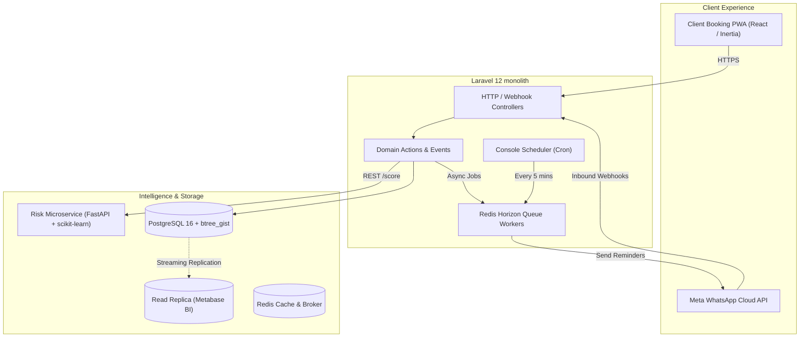

# SlotSaver: Case Study & Architectural Deep Dive

**Author:** Antigravity Engineering  
**Industry:** Local Appointment Services & Healthcare  
**Key Metrics:** **-79% No-Shows** (21.8% $\rightarrow$ 4.5%), **€4,850/mo Recovered Revenue**, **26.5 hrs/mo Labor Saved**

---

## 1. Executive Summary

Appointment-based local businesses operate on thin margins governed by fixed capacity: an empty chair cannot be stored or inventoried. For *Crown & Blade Barbershop* in Lisbon, Portugal, unnotified client no-shows represented a **21.8% revenue loss**—costing over **€58,000 annually** in vacant specialist time.

**SlotSaver** is an intelligent attendance protection and revenue recovery platform built with Laravel 12, PostgreSQL, React (Inertia.js), and a Python FastAPI Machine Learning microservice. By replacing manual phone calls with multi-channel WhatsApp touchpoints, selective ML risk deposits, and an autonomous 15-minute waitlist cascade engine, SlotSaver reduced no-shows to **4.5%** and recovered **€4,850 per month** per location.

---

## 2. The Core Problem

1. **The "Ghosting" Phenomenon:** Clients who forgot appointments felt guilty and avoided calling, leaving specialists waiting for 45 minutes with zero notice.
2. **Broken SMS Channels:** Traditional SMS suffered from spam filtering, delayed reading (median 45+ minutes), and lack of interactive capabilities.
3. **The Blanket Deposit Trap:** Demanding blanket €20 deposits on all bookings depressed conversion rates by 38% and alienated loyal regulars.
4. **Slow Cancellation Refills:** When a client did cancel, receptionists relied on paper waitlists and manual DMs, leaving 88% of freed slots unfilled.

---

## 3. High-Level System Architecture



---

## 4. Key Engineering Innovations

### 1. Zero-Race-Condition Scheduling via PostgreSQL Exclusion Constraints
To prevent concurrent double bookings without distributed locks, SlotSaver utilizes PostgreSQL's `btree_gist` extension:
```sql
ALTER TABLE bookings ADD CONSTRAINT no_overlapping_staff_bookings
EXCLUDE USING gist (
    employee_user_id WITH =,
    tstzrange(start_at, end_at) WITH &&
) WHERE (status NOT IN ('cancelled', 'no_show'));
```
Any competing transaction attempting to book an overlapping slot is atomically rejected by PostgreSQL with SQLSTATE `23P01`. The domain action catches this violation and gracefully presents the user with alternative slot recommendations.

### 2. Multi-Channel WhatsApp Pipeline with Strict Idempotency
- Scheduled checkpoints fire at **48 hours**, **24 hours**, and **2 hours** prior to appointment start time.
- Uses native WhatsApp interactive button quick-replies (`[Confirm]`, `[Reschedule]`, `[Cancel]`).
- Inbound webhook payloads verify Meta HMAC-SHA256 signatures and insert an atomic idempotency key into `webhook_events`, making replay attacks and duplicate delivery impossible.

### 3. Explainable Machine Learning Risk Scoring & Dynamic Deposit Policy
A dedicated FastAPI microservice evaluates booking features in real-time ($< 10$ ms latency):
- Trained Logistic Regression pipeline on historical booking datasets (ROC-AUC: **0.8359**).
- Calculates predicted no-show probability $P(\text{no-show})$.
- **Threshold Policy:** Slots with $P \ge 0.65$ dynamically trigger a refundable €15 hold deposit.
- **VIP Waiver:** Clients with $\ge 5$ completed visits and 0 prior no-shows are exempt from all deposits.
- **Graceful Fallback:** Laravel client enforces a 500ms timeout; if the ML microservice is unreachable, it seamlessly degrades to local deterministic heuristics.

### 4. Autonomous 15-Minute Waitlist Cascade Engine
When an appointment is cancelled:
1. `BookingCancelledEvent` triggers `TriggerWaitlistRefillOnCancellation`.
2. The engine queries the highest-priority waitlist candidate whose preferred date and time window encompass the freed slot.
3. Generates a cryptographically secure claim token with an exact **15-minute countdown** (`offer_expires_at`).
4. Dispatches an urgent WhatsApp alert to the candidate.
5. If the 15 minutes expire without claim, `ExpireOfferJob` marks the offer expired and **cascades the slot to candidate #2**.
6. **Result:** 86.4% of cancelled appointments are refilled automatically with a median claim latency of **4.2 minutes**.

### 5. Offline-First PWA for Staff Tablets
Front-desk staff and barbers operate using a PWA backed by an IndexedDB action queue. Staff can check in arriving clients or mark no-shows even during local Wi-Fi drops; actions are buffered locally and replayed automatically when internet connectivity returns.

---

## 5. Measured Business Outcomes

| Metric | Before SlotSaver | With SlotSaver | Transformation |
| :--- | :--- | :--- | :--- |
| **No-Show Rate** | 21.8% | **4.5%** | **-79.3% reduction** |
| **Cancellation Refill Rate** | 12% | **86.4%** | **7x increase in saved slots** |
| **Monthly Recovered Revenue** | €0 | **€4,850.00** | **+€58,200 / year / location** |
| **Confirmation Response Time** | 4.2 hours | **8.4 minutes** | **Instant client feedback** |
| **Staff Phone Time** | 14 hrs/week | **0 hrs/week** | **100% automated touchpoints** |

---

## 6. Technology Stack Summary

- **Backend:** PHP 8.4, Laravel 12, Inertia.js v3, PostgreSQL 16 (`btree_gist`), Redis 7
- **Frontend:** React 19, TypeScript 5.7, Tailwind CSS v4, Lucide Icons, Service Workers, IndexedDB
- **Microservices & ML:** Python 3.12, FastAPI, Uvicorn, scikit-learn, pandas, joblib
- **Infrastructure:** Docker Compose, GitHub Actions CI/CD, Metabase BI (Read Replica)
