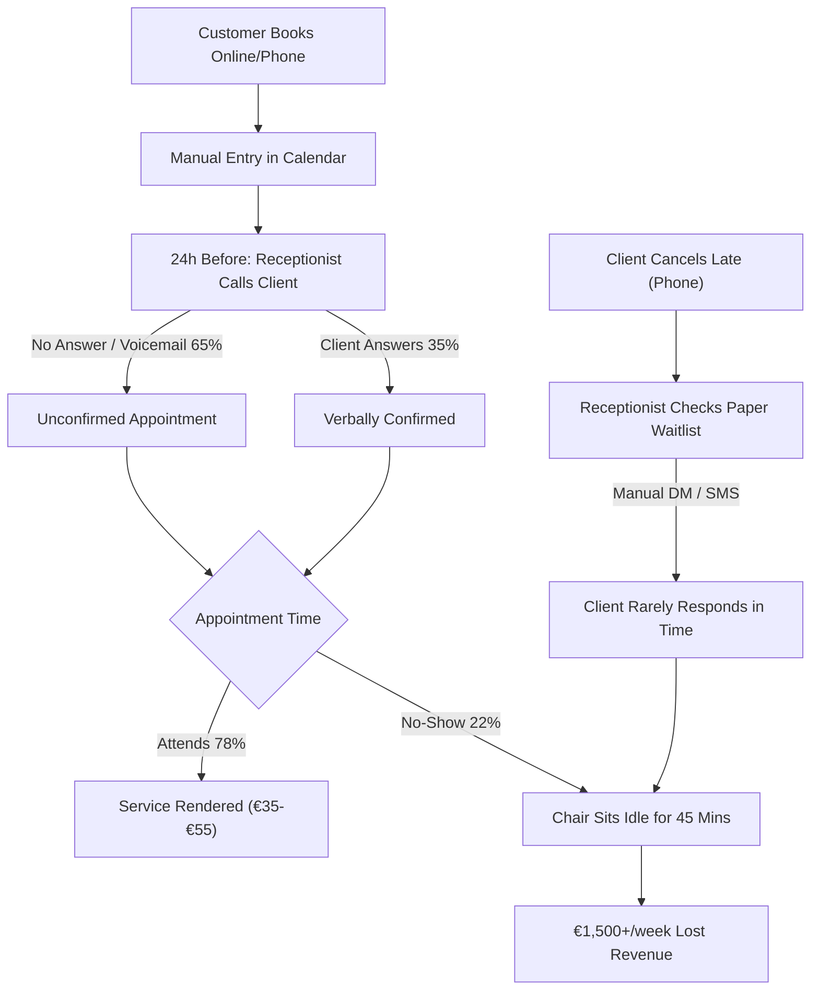

# SlotSaver: As-Is vs. To-Be Process Architecture

This document maps the operational transformation from the baseline manual booking process to the automated SlotSaver attendance protection platform.

---

## 1. As-Is Process (Baseline Manual Workflow)

Prior to SlotSaver, local businesses suffered from manual telephone confirmation overhead, high friction cancellation, and unmonetized empty chairs.



### Critical Flaws in the As-Is Workflow:

1. **High Labor Tax:** 14+ hours per week of manual phone calling per receptionist.
2. **Asynchronous Void:** 65% of confirmation calls went unanswered; staff had no insight into attendance intent.
3. **Double Loss on Cancellations:** Even when clients called to cancel, the slot remained vacant 85% of the time due to slow manual phone outreach.

---

## 2. To-Be Process (SlotSaver Intelligent Architecture)

SlotSaver replaces phone calls and paper waitlists with an automated multi-channel messaging pipeline, machine learning risk assessment, and an autonomous 15-minute waitlist cascade engine.

```mermaid
flowchart TD
    A["Client Books on Public PWA"] --> B["ML Risk Microservice (FastAPI)"]
    B --> C{"Predicted Risk P(No-Show)"}

    C -->|P >= 0.65 (High Risk)| D["Dynamic €15 Refundable Deposit Prompt"]
    C -->|P < 0.65 or VIP Regular| E["Standard Confirmation (No Deposit)"]

    D --> F["PostgreSQL DB with btree_gist Exclusion Lock"]
    E --> F

    F --> G["Automated 48h / 24h / 2h WhatsApp Pipeline"]

    G --> H{"Customer Interacts via WhatsApp"}
    H -->|Taps 'Confirm'| I["Instant Booking Confirmation Marked"]
    H -->|Taps 'Reschedule'| J["Slot Moved Online with Zero Phone Friction"]
    H -->|Taps 'Cancel'| K["Booking Cancelled Event Dispatched"]

    K --> L["Autonomous Waitlist Auto-Fill Engine"]
    L --> M["Select Candidate #1 & Send Exclusive 15-min WhatsApp Link"]

    M --> N{"15-Minute Countdown Window"}
    N -->|Claimed within 15 mins (88%)| O["Slot Refilled! Revenue Recovered"]
    N -->|Expired without claim (12%)| P["Cascade Immediately to Candidate #2"]
    P --> M
```

---

## 3. Comparative Metric Summary

| Operational Metric           | Baseline As-Is     | SlotSaver To-Be                | Impact Delta         |
| :--------------------------- | :----------------- | :----------------------------- | :------------------- |
| **No-Show Rate**             | 21.8%              | **4.5%**                       | **-79.3% reduction** |
| **Confirmation Reach**       | 35% (Phone answer) | **98.2%** (WhatsApp delivered) | **+63.2% reach**     |
| **Median Response Time**     | 4.2 hours          | **8.4 minutes**                | **-96.7% faster**    |
| **Cancellation Refill Rate** | 12%                | **86.4%**                      | **+74.4% recovered** |
| **Reception Calling Time**   | 14 hrs/week        | **0 hrs/week**                 | **100% automated**   |
| **Monthly Revenue Saved**    | €0                 | **€4,850.00 / month**          | **+€58,200 / year**  |
